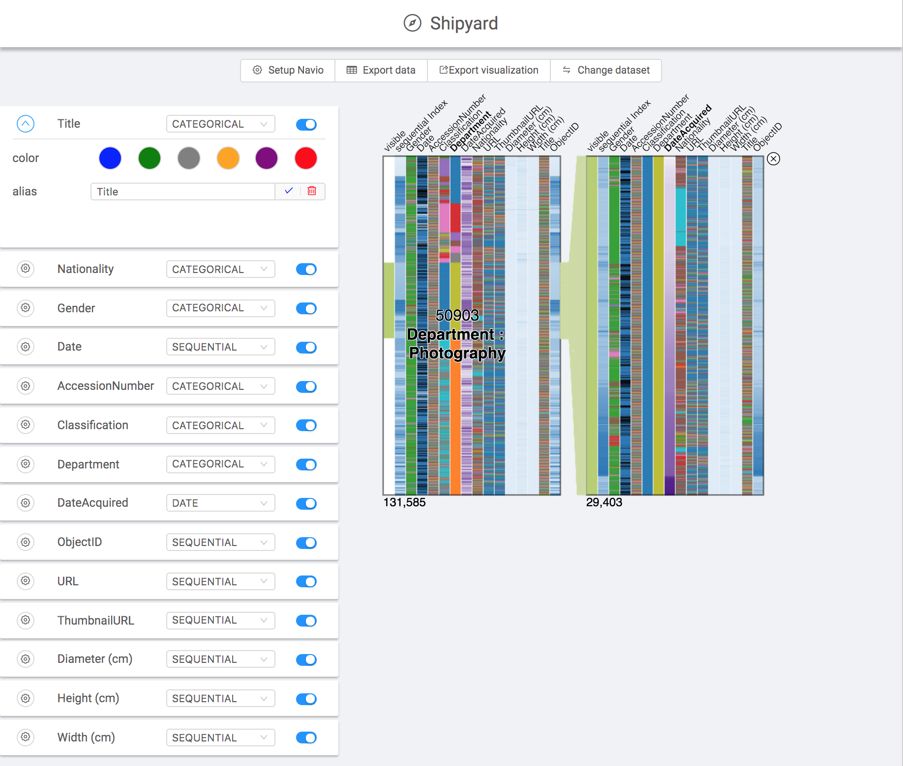

# Navio Shipyard

[Live Demo](https://john-guerra.github.io/shipyard/build/)

[Repository](https://github.com/john-guerra/shipyard)



## Synopsis
The Navio Shipyard is a desktop application that eases the use of the Navio without programming. Navio is a d3 visualization widget to helps summarizing, exploring and navigating large network visualizations.

## Motivation
The task of visualizing large multi-dimensional datasets is not trivial. It requires visualization design expertise to make a proper data exploration. In addition, as the data increases in size and dimensions, the task becomes more complex. Thus, to ease the exploration, summarization and visualization of large multi-dimensional datasets without losing the context of the data, John Alexis Guerra-Gómez developed Navio: a side visualization widget for aiding the navigation of network visualization. Nevertheless, to use this widget basic knowledge about programming , data processing and web development is crucial. For this reason, any user without the basic knowledge mentioned above would find useful a tool that allows them to upload, pre-process and visualize large multi-dimensional datasets using Navio.

## Installation

1. First of all, you must set a **permanent** enviornment variable called SHIPYARD_MAX_MEMORY. This variable´s value has to be the maximum amount of Random Access Memory that you want Shipyard to use (in Megabytes). The way to set this variable can vary depending on the OS. For example, if you want Shipyard to use 2 Gigabytes of memory (2048 MB), and your OS is Ubuntu, you have to set the variable as follows:
```sh
echo 'export SHIPYARD_MAX_MEMORY=2048' >> /etc/environment
```
2. Then, in the releases page of this repository, you can download the .exe or .appimage for Windows or linux respectivily. 
3. Finally, you double click the file, and can start using the aplication!

## Use
